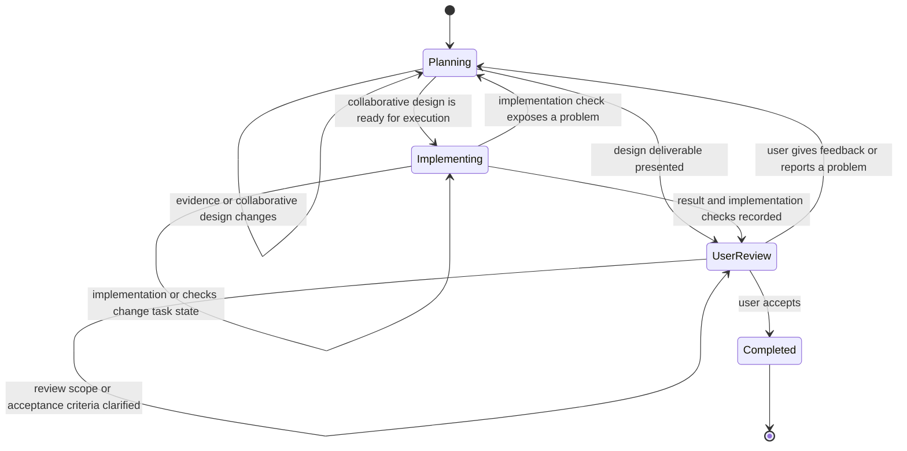

# Dev Checkpoint

Use one tracked Markdown document per development task:

```text
Docs/Checkpoint/<task-name>.md
```

This document preserves the current task state across sessions and agents. It
is not an ADR, a source of general project rules, or a raw conversation
transcript.

## Start Or Resume

1. For a new non-trivial task, create a descriptive kebab-case checkpoint file.
   Copy `CHECKPOINT-TEMPLATE.md` from this skill into
   `Docs/Checkpoint/<task-name>.md`. Reuse the existing task document when
   continuing prior work.
2. Before investigating or changing code, read the checkpoint and reconcile it
   with the current worktree and relevant source files.
3. Report any conflict between the checkpoint and observed code or Git state;
   do not silently treat either one as authoritative.

Skip a checkpoint only for a one-line answer or a clearly isolated command
whose result cannot affect later design or implementation work.

## Development Loop

The task has exactly one primary state. A checkpoint section, a transition
event, and a recovery procedure are not states.

| State | Meaning |
| --- | --- |
| `Planning` | The user and agent are collaboratively understanding the goal, inspecting relevant code, and negotiating or revising the design. |
| `Implementing` | The agreed work is being applied. Code edits, builds, tests, and other implementation checks are part of this state. |
| `UserReview` | A coherent implementation or design result has been presented for the user's review. |
| `Completed` | The delivered result has been accepted by the user. |

`Staging` is the active iteration data, not a state. `Resume` and
reconciliation are session-entry procedures, not states. Do not introduce a
separate state merely because the agent is waiting for a response or running a
verification command. Use the focused Staging item to record a concrete problem
that needs evidence or causal understanding; the primary task state remains
`Planning`.

The development loop is:



On a new session, read every checkpoint section, compare it with the worktree,
and update `Work State`. Preserve the recorded primary state when the
checkpoint matches observed facts. When reconciliation reveals a concrete
problem, add a Staging item, set `Focus` when it becomes current work, and
enter or remain in `Planning`.

## Staging List

Staging is an open list of unresolved items. Give every item a stable `S-xx`
identifier and never renumber remaining items. `Focus` names exactly one open
item, or `none` when no item is active. New problems may be appended while
another item is focused; work may switch to any item by changing `Focus`.

Do not use item-level Origin or Status fields. Each item's problem, known
facts, unresolved question, proposed resolution, and exit criteria describe
its current situation without duplicating the task's primary state.

## State Commit Points

The canonical checkpoint schema is
[`CHECKPOINT-TEMPLATE.md`](CHECKPOINT-TEMPLATE.md). Update its sections at
every state transition as follows:

| Transition | Required checkpoint updates |
| --- | --- |
| `New task -> Planning` | Set `Status`; write `Goal`; list known `Involved Modules`; record the initial worktree and next action in `Work State`. Add Staging items as design questions or initial implementation plans become concrete; set `Focus` when one becomes active. |
| `Planning -> Planning` | Update `Goal` when boundaries change; add discovered relationships to `Involved Modules`; add or revise design points; update the focused or otherwise affected Staging item with evidence, a proposed resolution, or an unresolved question; change `Focus` when work switches; update `Work State` with the next safe step. |
| `Planning -> Implementing` | Record the jointly agreed plan in the focused Staging item; promote agreed module scope and design constraints into stable sections; record implementation files and the next edit in `Work State`. |
| `Planning -> UserReview` | Record the design deliverable and its supporting evidence in stable sections and `Work State`; set `Status` to `UserReview`. |
| `Implementing -> Implementing` | Record edited files, command results, and non-terminal implementation evidence in `Work State`; update focused or otherwise affected Staging items with progress, failures, or changed exit criteria. Update stable sections only when implementation confirms a lasting design fact. |
| `Implementing -> UserReview` | Update active `Staging` items with the implemented resolution and check results; record changed files and all verification evidence in `Work State`; set `Status` to `UserReview`. |
| `Implementing -> Planning` | Create or update a Staging item with the failed implementation check, its evidence, and suspected impact; set `Focus` when it becomes current work. Do not promote a speculative repair into stable sections. |
| `UserReview -> UserReview` | Record clarified review scope, acceptance criteria, or user observations that do not yet require new design or implementation work. Keep `Status` as `UserReview`. |
| `UserReview -> Planning` | Create a Staging item for each materially independent feedback item; set `Focus` to the selected next item. Update `Work State`; update stable sections only after the new design is jointly established. |
| `UserReview -> Completed` | Reconcile every resolved staging item into `Goal`, `Involved Modules`, and `Design Points, Considerations And Constraints`; remove resolved staging items; set `Status` to `Completed` and record final evidence and repository state in `Work State`. |

Every tool call is a checkpoint opportunity, not an automatic checkpoint
commit. Commit `A -> A` or `A -> B` when a tool result, user message, or agent
decision changes any durable task fact: scope, module involvement, design
points, staging focus or item content, implementation evidence, acceptance
criteria, or next safe step.

At the end of each non-trivial assistant turn, persist all semantic changes
since the previous checkpoint commit. During a long multi-tool execution,
commit after a result changes the durable task state and before the next
long-running command, network-dependent operation, subagent delegation, or
other step that could prevent clean continuation. Do not write a checkpoint
when the result is merely routine output with no effect on recoverable state.

When a staging item is resolved, first merge its lasting outcome into the
stable sections it affects. If it is focused, move Focus to another open item
or `none`, then remove the resolved item. Git history retains the iteration
record; keep a resolved item only when it prevents a likely future regression
or repeated rejected design.

Keep proposal, feedback, and confirmation separate. Do not record an
unconfirmed plan as a decision, or a user-reported issue as verified fact until
the relevant evidence has been checked.

Only one agent should edit a task checkpoint at a time. Subagents report
findings to their parent; the parent updates the checkpoint unless explicitly
assigned ownership of that document.

## Completion

When the user accepts the delivered result, set `Status: Completed`, record
the final evidence, any remaining limitations, and the final repository state.
Do not delete a
checkpoint automatically. The user decides whether the completed task document
is retained, archived, or removed.
